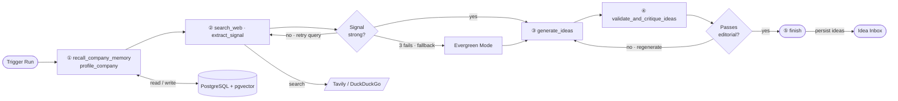
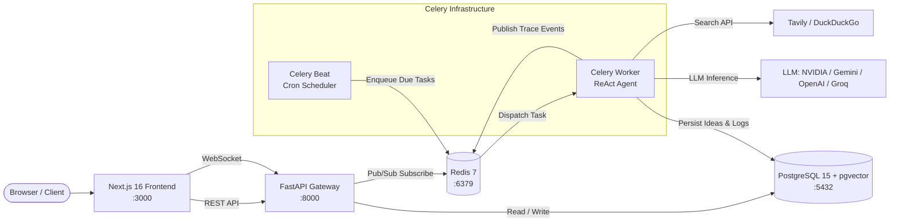

# BrandPulse

> **Autonomous content strategy engine powered by a multi-provider ReAct AI agent.**

BrandPulse continuously monitors market signals, generates platform-ready social media content ideas, and learns from human feedback — fully automated, end-to-end. Built for B2B marketing teams who want AI-generated content that is specific, grounded in real events, and sounds human.

**🚀 Business Impact: 95% Faster than Manual AI Prompting**  
Even with tools like ChatGPT, marketers spend 20–30 minutes manually searching for industry news, feeding context into prompts, and requesting rewrites. BrandPulse replaces this entire manual research workflow with an autonomous agent, cutting a 30-minute task down to an asynchronous background job.

---

## Table of Contents

- [Key Engineering Highlights](#key-engineering-highlights)
- [Screenshots](#screenshots)
- [Agent Architecture](#agent-architecture)
- [System Architecture](#system-architecture)
- [Tech Stack](#tech-stack)
- [What It Does](#what-it-does)
- [Setup & Installation](#setup--installation)
- [Environment Variables](#environment-variables)
- [Usage Guide](#usage-guide)
- [Live Run Tracing & Observability](#live-run-tracing--observability)
- [Project Structure](#project-structure)
- [Database Models](#database-models)
- [API Reference](#api-reference)
- [Development & Operations](#development--operations)
- [Troubleshooting](#troubleshooting)
- [Supported Providers & Free Tiers](#supported-providers--free-tiers)

---

## Key Engineering Highlights

- **Universal Multi-Provider Model Factory**: Clean abstraction layer supporting **NVIDIA NIM**, **Google Gemini**, **OpenAI**, and **Groq** (plus custom OpenAI-compatible endpoints like Ollama, vLLM, or Google's OpenAI bridge). Switch providers, models, temperatures, and token limits dynamically via `.env` without modifying Python code.
- **Resilient Autonomous ReAct Agent**: Custom Reason + Act loop with dynamic tool invocation, self-critique editorial validation, automatic evergreen fallback, and hard iteration caps.
- **Live Database-Polled Execution Kill Switch**: Worker threads poll `is_processing` in real time during the ReAct loop, allowing immediate agent termination if an administrator triggers "Force Reset" in the UI.
- **Network Kill-Switch & Managed Retries**: 180s hard socket timeout and zero internal SDK retries (`max_retries=0`) prevent frozen background threads, seamlessly bubbling network failures to Celery backoff retry queues.
- **Race Condition & Collision Guards**: Database-level concurrency locking (`is_processing`) returns `409 Conflict` on redundant run triggers; Celery Beat employs distributed Redis locks to prevent duplicate cron dispatch.
- **Real-Time Distributed Tracing**: Redis Pub/Sub to WebSocket pipeline streams live agent thoughts, tool calls, retry notifications, and completion summaries straight to the frontend.
- **Production Data & Vector Memory**: PostgreSQL 15 with **pgvector** for semantic similarity search, SQLAlchemy 2 ORM, and strict Pydantic schemas for deterministic LLM outputs.

---

## Screenshots

<table>
  <tr>
    <td width="50%" valign="top">
      <b>1. Idea Inbox & Review</b><br/>
      Review, approve, reject, or request rewrites.<br/><br/>
      
    </td>
    <td width="50%" valign="top">
      <b>2. Content Library</b><br/>
      Filterable central repository of approved ideas.<br/><br/>
      
    </td>
  </tr>
  <tr>
    <td width="50%" valign="top">
      <b>3. Live Agent Trace & Status</b><br/>
      Watch tool calls and execution nodes stream live.<br/><br/>
      
    </td>
    <td width="50%" valign="top">
      <b>4. Human-in-the-Loop (HITL) Refinement</b><br/>
      Request precise AI rewrites with custom feedback.<br/><br/>
      
    </td>
  </tr>
  <tr>
    <td width="50%" valign="top">
      <b>5. Company Settings & Schedule</b><br/>
      Configure run frequencies, status, and company details.<br/><br/>
      
    </td>
    <td width="50%"></td>
  </tr>
</table>

---

## Agent Architecture

The core of BrandPulse is an autonomous **ReAct (Reason + Act) agent** where the LLM independently reasons about signal quality, content angles, and editorial validity at each step.

### Agent Tools

| Tool | Role | Description |
|---|---|---|
| `recall_company_memory` | Memory Retrieval | Reads past used angles, rejected angles, and recent hooks from PostgreSQL. Always called first. |
| `profile_company` | Intelligence Extraction | Extracts industry space, target audience, brand voice, differentiators, and geographic focus. |
| `search_web` | Market Research | Searches for recent market news via **Tavily** (with automatic fallback to **DuckDuckGo**). |
| `extract_signal` | Signal Evaluation | Filters and verifies news: assesses whether the market event is specific, recent, and verifiable. |
| `generate_ideas` | Content Ideation | Generates 4 structured content ideas grounded in the signal and selected content angle. |
| `validate_and_critique_ideas` | Self-Critique | Editorial check verifying hook strength, body coherence, CTA relevance, and brand alignment. |
| `finish` | State Finalization | Submits validated ideas to the database and cleanly terminates the ReAct cycle. |

### Decision Loop



### Dual-Model Architecture (Primary vs. Structured)

To maximize reliability and reduce costs, BrandPulse separates execution into two model roles:
1. **Primary LLM (`LLM_PROVIDER` / `LLM_MODEL`)**: Operates the creative ReAct loop, ideation, and conversational copywriting.
2. **Structured LLM (`STRUCTURED_LLM_PROVIDER` / `STRUCTURED_LLM_MODEL`)**: Uses deterministic settings (`temperature=0.1`) and strict Pydantic schemas for JSON profile extraction, signal evaluation, and editorial critiquing.

### Content Angle Taxonomy

The agent selects from 10 distinct content angles tracked per company to guarantee diversity:

```text
build-in-public        | user-perception      | hiring-and-culture
contrarian-take        | industry-trend       | competitive-positioning
data-driven-insight    | founder-story        | product-update
customer-success
```

* Rejected angles are flagged in memory and avoided.
* Overused angles are dynamically deprioritized.
* Unexplored angles are actively surfaced as opportunities.

### Human-in-the-Loop (HITL) Refinement

Reviewers can request an AI rewrite of any pending idea with written instructions. A dedicated Celery worker task (`process_idea_refinement`) re-invokes the model with the original idea and admin feedback, transitioning the status to `refining` and returning it to the `Review` tab once complete. If a rewrite fails, the idea is safely restored to `pending` with diagnostic notes.

---

## System Architecture



### Container Services

| Service | Container Name | Technology | Port | Role |
|---|---|---|---|---|
| `frontend` | `brandpulse_frontend` | Next.js 16, React 19, TypeScript | `3000` | Idea inbox, strategy dashboard, live execution trace |
| `api` | `brandpulse_api` | FastAPI, Uvicorn, WebSockets | `8000` | REST API, WebSocket pub/sub gateway, auth middleware |
| `worker` | `brandpulse_worker` | Celery 5.4, Celery Beat | — | ReAct agent runner, scheduler, asynchronous task processor |
| `postgres` | `brandpulse_postgres` | PostgreSQL 15 + pgvector | `5432` | Relational data, RAG embeddings, run logs, audit trails |
| `redis` | `brandpulse_redis` | Redis 7 (Alpine) | `6379` | Celery broker, distributed locks, WebSocket message pub/sub |

---

## Tech Stack

| Layer | Technology | Version | Purpose |
|---|---|---|---|
| **Frontend Framework** | Next.js (App Router) | 16.2.6 | Server and client rendering |
| **UI Runtime** | React | 19.2.4 | Interactive interface |
| **State & Data Fetching**| TanStack React Query | 5.104.0 | Server-state caching and invalidation |
| **Animation & Icons** | Framer Motion & Lucide | 12.39 / 1.16 | Animations and modern iconography |
| **Backend API** | FastAPI | 0.115.0 | High-performance asynchronous API |
| **ASGI Server** | Uvicorn | 0.32.0 | Production server runner |
| **LLM Orchestration** | LangChain / LangGraph | 0.3.13 | Prompting, tool bindings, structured outputs |
| **AI Providers** | NVIDIA NIM, Google Gemini, OpenAI, Groq | — | Multi-provider LLM inference |
| **Web Search** | Tavily (`tavily-python`) & DuckDuckGo | 0.3.3 / 7.1.0 | Real-time market signal retrieval |
| **Task Queue** | Celery + Celery Beat | 5.4.0 | Asynchronous agent tasks and scheduling |
| **Message Broker** | Redis | 7.x | Celery queue and live trace pub/sub |
| **Database** | PostgreSQL + pgvector | 15 / 0.3.6 | Relational data and semantic vector storage |
| **ORM & Migrations** | SQLAlchemy 2.0 & Alembic | 2.0.36 / 1.14 | Schema modeling and database operations |
| **PDF Extraction** | PyPDF / PyPDF2 | 5.1.0 / 3.0.1 | Extract company profiles from documents |
| **Containerization** | Docker & Docker Compose | — | Multi-service orchestration |

---

## What It Does

1. **Recalls Memory**: Queries past used and rejected angles from PostgreSQL to avoid repetition.
2. **Profiles Company**: Distills uploaded PDFs or text into audience, brand voice, and differentiators.
3. **Researches News**: Conducts focused searches on Tavily or DuckDuckGo for recent market news.
4. **Validates Signal**: Checks news freshness and verifiable substance; falls back to evergreen mode if dry.
5. **Selects Angle**: Chooses a fresh content strategy based on company history.
6. **Generates Ideas**: Crafts 4 distinct ideas (hook, body, CTA, platform, implication type).
7. **Self-Critiques**: Scores ideas against editorial quality criteria, regenerating weak outputs.
8. **Live Tracing**: Streams tool events in real time to the frontend via WebSockets.
9. **Human Feedback**: Marketers approve, reject, or request targeted rewrites in the Inbox.

---

## Setup & Installation

### Prerequisites

- [Docker Desktop](https://www.docker.com/products/docker-desktop/) installed and running.
- An API key for your chosen LLM provider:
  - **NVIDIA NIM** ([build.nvidia.com](https://build.nvidia.com/))
  - **Google AI Studio** ([aistudio.google.com](https://aistudio.google.com/app/apikey))
  - **OpenAI** ([platform.openai.com](https://platform.openai.com/))
  - **Groq** ([console.groq.com](https://console.groq.com/))
- *(Optional)* A [Tavily Search API key](https://tavily.com) (free tier provides 1,000 searches/mo; falls back to free DuckDuckGo automatically if omitted).

### 1. Clone & Enter Directory

```bash
git clone <repo-url>
cd brandpulse/brandpulse-engine
```

### 2. Configure Environment

Copy the example configuration:

```bash
cp .env.example .env
```

Edit `.env` to configure your preferred provider. For example, using **NVIDIA NIM**:

```env
LLM_PROVIDER=nvidia
LLM_MODEL=deepseek-ai/deepseek-v4.1-flash
LLM_MAX_TOKENS=8192
LLM_TEMPERATURE=0.7

STRUCTURED_LLM_PROVIDER=nvidia
STRUCTURED_LLM_MODEL=deepseek-ai/deepseek-v4.1-flash
STRUCTURED_LLM_MAX_TOKENS=2048
STRUCTURED_LLM_TEMPERATURE=0.1

NVIDIA_API_KEY=nvapi-...
TAVILY_API_KEY=tvly-...
```

Or using **Google Gemini**:

```env
LLM_PROVIDER=google
LLM_MODEL=gemini-2.5-flash
GOOGLE_API_KEY=AIzaSy...
```

### 3. Launch with Docker Compose

```bash
docker compose up -d --build
```

This builds and boots all 5 containers (`brandpulse_postgres`, `brandpulse_redis`, `brandpulse_worker`, `brandpulse_api`, `brandpulse_frontend`). Database tables and the `pgvector` extension are initialized automatically on boot.

### 4. Access Interfaces

| Interface | URL | Description |
|---|---|---|
| **Web Dashboard** | http://localhost:3000 | Inbox, Strategy Memory, Library, and Company Management |
| **FastAPI Swagger Docs**| http://localhost:8000/docs | Interactive API documentation |
| **API Health Check** | http://localhost:8000/health | Service and database connectivity check |

---

## Environment Variables

| Variable | Required | Default | Description |
|---|:---:|---|---|
| `DATABASE_URL` | ✅ | `postgresql://...` | Full PostgreSQL connection string |
| `POSTGRES_DB` | ✅ | `brandpulse` | PostgreSQL database name |
| `POSTGRES_USER` | ✅ | `brandpulse_user` | PostgreSQL database user |
| `POSTGRES_PASSWORD` | ✅ | `change_me_in_production` | PostgreSQL database password |
| `REDIS_URL` | ✅ | `redis://redis:6379/0` | Redis broker and Pub/Sub connection URL |
| `LLM_PROVIDER` | ✅ | `nvidia` | Primary provider: `nvidia`, `google`, `openai`, `groq` |
| `LLM_MODEL` | ✅ | `deepseek-ai/deepseek-v4.1-flash`| Model identifier for the ReAct loop |
| `LLM_MAX_TOKENS` | ⬜ | `4096` | Max generation tokens for the primary agent |
| `LLM_TEMPERATURE` | ⬜ | `0.7` | Sampling temperature for the primary agent |
| `STRUCTURED_LLM_PROVIDER`| ⬜ | Same as `LLM_PROVIDER` | Provider for structured JSON tasks |
| `STRUCTURED_LLM_MODEL` | ⬜ | Same as `LLM_MODEL` | Model for extraction, validation, and critique |
| `STRUCTURED_LLM_MAX_TOKENS`| ⬜ | `2048` | Max generation tokens for structured tasks |
| `STRUCTURED_LLM_TEMPERATURE`| ⬜ | `0.1` | Low temperature for deterministic outputs |
| `NVIDIA_API_KEY` | ⬜ | — | Required if provider is `nvidia` |
| `GOOGLE_API_KEY` | ⬜ | — | Required if provider is `google` |
| `OPENAI_API_KEY` | ⬜ | — | Required if provider is `openai` |
| `GROQ_API_KEY` | ⬜ | — | Required if provider is `groq` |
| `OPENAI_BASE_URL` | ⬜ | — | Custom endpoint (e.g. Gemini OpenAI adapter, Ollama, vLLM) |
| `TAVILY_API_KEY` | ⬜ | — | Web search API key (falls back to DuckDuckGo if missing) |
| `ENABLE_WEB_SEARCH` | ⬜ | `true` | Set `false` to run strictly in evergreen mode |
| `NEXT_PUBLIC_API_URL` | ⬜ | `http://localhost:8000/api` | API endpoint accessed by the frontend |
| `SCHEDULER_CHECK_INTERVAL`| ⬜ | `300` | How often Celery Beat checks for due companies (seconds) |
| `MAX_PDF_SIZE_MB` | ⬜ | `10` | Upload limit for company profile PDFs |
| `LOG_LEVEL` | ⬜ | `INFO` | Logging level (`DEBUG`, `INFO`, `WARNING`, `ERROR`) |

---

## Usage Guide

### 1. Adding a Company
1. Open [http://localhost:3000](http://localhost:3000) and click **+ Add Company**.
2. Provide the company name, description, run frequency (hours), and an optional PDF (pitch deck, product one-pager, website export).
3. On submission, BrandPulse automatically extracts text, stores the company, and directs you to the company's Inbox.

### 2. Reviewing Ideas
From the company **Inbox** (`/companies/{id}/inbox`), ideas are organized into 4 workflow tabs:
- **Review (`pending`)**: Newly generated ideas awaiting editorial review.
- **Approved (`approved`)**: Ideas accepted by reviewers; signals success to the memory engine.
- **Rejected (`rejected`)**: Discarded ideas; signals the agent to avoid this angle in future runs.
- **Rewriting (`refining`)**: Ideas currently undergoing Human-in-the-Loop AI rewrites.

### 3. Content Strategy & Angle Memory
Navigate to **Strategy** (`/companies/{id}/memory`):
- **Untapped Themes**: Content angles never tested for this company.
- **Explored Themes**: Angles previously used, displaying historical approval rates.
- **Experimental Themes**: Wildcard directions selected by the agent.

### 4. Content Library
Access the global **Content Library** (`/library`):
- Central searchable view of all approved ideas across all companies.
- Filter by company, social platform, implication type, and content angle.

---

## Live Run Tracing & Observability

Every tool call is broadcasted over Redis channel `trace:{company_id}`. The FastAPI WebSocket gateway forwards these events directly to the browser.

### Trace Events

```text
● Recalling past content angles    ✓
● Profiling company                 ✓
● Searching market news             ✓
● Extracting key signal             ✓
● Generating content ideas          ✓
● Validating ideas                  ✓
● Saving ideas                      ✓
```

### Safety & Recovery Mechanisms
- **Stuck Agent Detection & Force Reset**: If an agent hangs or a worker restarts unexpectedly, the UI displays an **"Agent appears to be stuck"** banner with a **Force Reset** button. This calls `POST /api/companies/{id}/reset-lock`, freeing the lock and aborting any running loop.
- **Run Summaries**: When a run completes, the trace panel displays an explicit status banner (e.g. `✓ 4 ideas added to Review` or `⚠ No ideas passed quality validation`).
- **Auto-Retry Indicators**: If an API call fails, the UI displays real-time retry progress (`Retrying... attempt 1 of 3`) rather than crashing.

---

## Project Structure

```text
brandpulse/
├── README.md
├── docs/
│   └── screenshots/                    # UI walkthrough screenshots
└── brandpulse-engine/
    ├── docker-compose.yml              # Service orchestration
    ├── Dockerfile.backend              # Shared container for API and Worker
    ├── requirements.txt                # Python dependencies
    ├── .env.example                    # Environment template
    │
    └── services/
        ├── shared/                     # Cross-service shared modules
        │   ├── models.py               # SQLAlchemy models (Company, GeneratedIdea, RunLog, etc.)
        │   ├── database.py             # Engine, session factory, connection health
        │   └── init_db.py              # Schema creation and pgvector activation
        │
        ├── worker/                     # Celery background tasks and ReAct agent
        │   ├── celery_app.py           # Celery application and Beat schedule
        │   ├── scheduler.py            # Worker entry point
        │   ├── agent/                  # Core intelligence
        │   │   ├── core.py             # run_ideation_v4() ReAct loop with kill switch
        │   │   ├── llm.py              # Dynamic Multi-Provider Model Factory
        │   │   ├── tools.py            # 7 ReAct tools (Tavily/DDG search, profiling, etc.)
        │   │   ├── prompts.py          # System prompts and angle taxonomy
        │   │   └── schemas.py          # Pydantic schemas for structured extraction
        │   └── tasks/
        │       ├── ideation_task.py    # Celery tasks: queue_generation_tasks, process_company_ideation
        │       └── generation_task.py  # Session helper tasks
        │
        ├── api/                        # FastAPI REST API & WebSocket server
        │   ├── main.py                 # FastAPI application, CORS, Redis event bridge
        │   ├── dependencies.py         # Database session injection
        │   └── routers/
        │       ├── companies.py        # Company CRUD, trigger run (409 guard), reset-lock
        │       ├── ideas.py            # Idea approve, reject, refine endpoints
        │       ├── dashboard.py        # Cross-company stats and activity feed
        │       └── websockets.py       # WebSocket connection manager and trace broadcaster
        │
        └── frontend/                   # Next.js 16 web application
            ├── package.json
            ├── Dockerfile
            └── src/
                ├── components/         # Shared UI (Sidebar, AddCompanyModal, etc.)
                ├── hooks/
                │   └── useLiveTrace.ts # WebSocket trace hook with retry/summary state
                └── app/
                    ├── page.tsx        # Dashboard (metrics, activity feed, companies)
                    ├── library/        # Content Library (approved ideas across companies)
                    └── companies/[id]/
                        ├── inbox/      # Review inbox, live trace panel, stuck lock reset
                        ├── memory/     # Content Strategy angle memory
                        └── settings/   # Frequency, pause/active status, deletion
```

---

## Database Models

| Model | Table | Key Fields | Purpose |
|---|---|---|---|
| `Company` | `companies` | `id`, `name`, `description`, `pdf_text`, `embedding`, `frequency_hours`, `next_run_time`, `is_processing`, `status` | Registry of client companies. Tracks scheduling and concurrency locks. |
| `CompanyProfile` | `company_profiles` | `company_id`, `space`, `audience`, `content_fit`, `brand_voice`, `key_differentiators`, `region` | Cached LLM-extracted structured company intelligence. |
| `GeneratedIdea` | `generated_ideas` | `company_id`, `run_log_id`, `hook`, `body`, `cta`, `platform`, `angle_category`, `signal_used`, `status`, `admin_feedback` | Content ideas generated per run. Statuses: `pending`, `approved`, `rejected`, `refining`. |
| `RunLog` | `run_logs` | `company_id`, `trace` (JSONB), `status`, `created_at` | Audit trail storing execution node history, errors, and idea counts. |
| `Metric` | `metrics` | `total_insights`, `pending_count`, `approved_count`, `rejected_count`, `avg_processing_time` | System performance and approval rate analytics. |
| `EmailLog` | `email_logs` | `company_id`, `email_type`, `recipient_email`, `sent_successfully` | Audit logs for dispatched delivery emails. |

---

## API Reference

### Companies (`/api/companies`)

| Method | Endpoint | Description |
|---|---|---|
| `GET` | `/` | List all companies with pending idea counts |
| `POST` | `/` | Create a new company |
| `GET` | `/{id}` | Retrieve company details |
| `PATCH` | `/{id}` | Update company details and schedule frequency |
| `DELETE` | `/{id}` | Delete company and cascade-delete all related records |
| `POST` | `/{id}/run` | **Trigger an ideation run** (returns `409 Conflict` if already running) |
| `POST` | `/{id}/reset-lock` | **Emergency reset**: clears a stuck `is_processing` lock |
| `GET` | `/{id}/ideas` | List ideas for a company (supports `status` filter) |
| `GET` | `/{id}/runs` | List execution run logs |
| `GET` | `/{id}/angles` | Content angle usage and approval analytics |

### Ideas (`/api/ideas`)

| Method | Endpoint | Description |
|---|---|---|
| `GET` | `/` | List ideas across companies with optional filtering |
| `GET` | `/{id}` | Retrieve a specific idea |
| `PATCH` | `/{id}/approve` | Approve a pending idea (marks status as `approved`) |
| `PATCH` | `/{id}/reject` | Reject an idea with optional feedback notes |
| `POST` | `/{id}/refine` | Request an AI rewrite with specific editorial feedback |

### Dashboard & WebSockets

| Method | Endpoint | Description |
|---|---|---|
| `GET` | `/api/dashboard/stats` | Aggregated metrics: total ideas, pending, approval rate |
| `GET` | `/api/dashboard/activity` | Unified timeline of recent run logs across all companies |
| `GET` | `/health` | API and database health check |
| `WS` | `/api/ws/trace/{company_id}` | **Live WebSocket stream** broadcasting agent trace nodes |

---

## Development & Operations

### Rebuilding Containers

To apply `.env` changes, Docker Compose changes, or Python updates:

```bash
# Rebuild and start in background
docker compose up -d --build

# Restart a specific service
docker compose restart worker
```

### Viewing Logs

```bash
# Follow all container logs
docker compose logs -f

# Follow worker or API logs specifically
docker compose logs -f worker
docker compose logs -f api
```

### Inspecting PostgreSQL

```bash
# Open interactive PostgreSQL shell
docker exec -it brandpulse_postgres psql -U brandpulse_user -d brandpulse
```

Useful database queries:

```sql
-- Check company processing status and schedule
SELECT id, name, is_processing, status, next_run_time FROM companies;

-- View recent execution logs and status
SELECT id, company_id, status, created_at, trace->>'error' AS error FROM run_logs ORDER BY created_at DESC LIMIT 5;

-- Check generated idea distribution
SELECT status, count(*) FROM generated_ideas GROUP BY status;
```

---

## Troubleshooting

### 1. Worker reports `404 / 410 / Model not found`
- Verify that your model name in `LLM_MODEL` is valid for your API key.
- If using NVIDIA NIM, ensure your account has access to the specific model (e.g. `deepseek-ai/deepseek-v4.1-flash`).
- When switching models in `.env`, always run `docker compose up -d` so Docker flushes its environment cache.

### 2. Company shows "Generating now..." but nothing is happening
- If the agent encountered an unhandled network error or container restart, the `is_processing` lock may remain set.
- Navigate to the company's Inbox and click **Force Reset** on the stuck banner, or issue:
  ```bash
  curl -X POST http://localhost:8000/api/companies/<COMPANY_ID>/reset-lock
  ```

### 3. Agent calls time out on large context
- The LLM client includes a default 180-second socket timeout (`timeout=180.0`).
- If using large reasoning models (such as Kimi or Nemotron), adjust `LLM_MAX_TOKENS` in `.env` down to `4096` or `2048` so responses generate within the timeout window.

### 4. WebSocket trace panel not updating
- Ensure Redis is running: `docker compose ps redis`.
- Verify the frontend is connecting to the correct API address via `NEXT_PUBLIC_API_URL` (default: `http://localhost:8000/api`).

---

## Supported Providers & Free Tiers

| Provider | Recommended Models | Notes |
|---|---|---|
| **NVIDIA NIM** | `deepseek-ai/deepseek-v4.1-flash`<br/>`meta/llama-3.1-70b-instruct` | Generous free credits on sign-up; high throughput. |
| **Google Gemini** | `gemini-2.5-flash`<br/>`gemini-2.0-flash` | Free tier available via Google AI Studio. |
| **OpenAI** | `gpt-4o-mini`<br/>`gpt-4o` | Pay-as-you-go; industry standard structured outputs. |
| **Groq** | `llama3-70b-8192`<br/>`mixtral-8x7b-32768` | Ultra-low latency inference. |
| **Tavily Search** | Basic Web Search | 1,000 free searches/month; seamless fallback to DuckDuckGo. |
